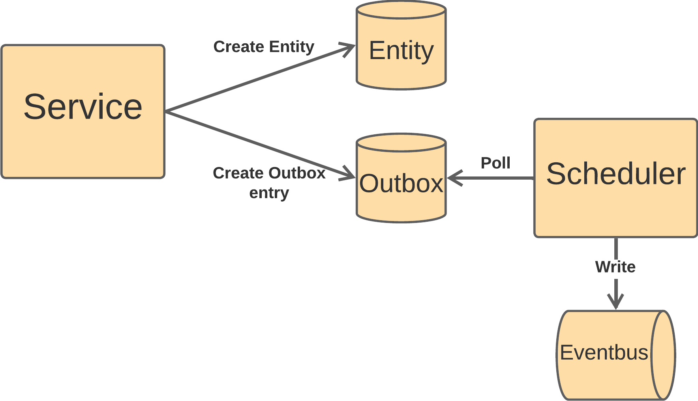

# About this repo

This repository demonstrates the implementation of the outbox pattern using Spring Boot and Kafka.
In my [YouTube video](https://youtu.be/fQKbUmqkzzg), I guide you through the step-by-step process of setting up the outbox pattern.



## Prerequisites

* Docker
* Java JDK Version 17+

## Running the Application

Build the project using the included Maven wrapper:

```bash
./mvnw clean install
```

Navigate to the `infra` directory and execute `docker compose up`:

```bash
cd infra/
docker compose up
```

In a different terminal start the project using the Spring Boot Maven plugin:

```bash
./mvnw spring-boot:run
```

